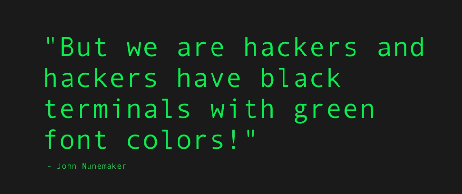

## Welcome to Security GitHub Pages

Here will all information about our class be. All from our schedule to links and infomations about theory. 

### Navigation

Link | Description
------------ | -------------
Studieplan | Den overordnet beskrivelse af valgfaget
Skema | Skemaet for valgfaget
 | 
Uge 1: Subject | Ugeplan for uge 35, med tilhørende materialer
Uge 2: Subject | Ugeplan for uge 36, med tilhørende materialer
Uge 3: Subject | Ugeplan for uge 37, med tilhørende materialer
Uge 4: Subject | Ugeplan for uge 38, med tilhørende materialer
Uge 5: Subject | Ugeplan for uge 39, med tilhørende materialer
Uge 6: Subject | Ugeplan for uge 40, med tilhørende materialer
Uge 7: Subject | Ugeplan for uge 41, med tilhørende materialer
Uge 8: Subject | Ugeplan for uge 43, med tilhørende materialer
Uge 9: Subject | Ugeplan for uge 44, med tilhørende materialer
Uge 10: Subject | Ugeplan for uge 45, med tilhørende materialer
Uge 11: Subject | Ugeplan for uge 46, med tilhørende materialer
Uge 12: Subject | Ugeplan for uge 47, med tilhørende materialer
Uge 13: Subject | Ugeplan for uge 48, med tilhørende materialer
Uge 14: Subject | Ugeplan for uge 49, med tilhørende materialer
Uge 15: Subject | Ugeplan for uge 50, med tilhørende materialer
 | 
Eksamen | Information angående eksamen
Bilag | Links, dokumenter og andre bilag vil blive lagt ind he

### Support or Contact

Having trouble with a something? Check out our [slack group](https://datamatiker-security.slack.com/) where you can write in the [help chat](https://app.slack.com/client/TMGKRJMJR/CM58R2AKD)
